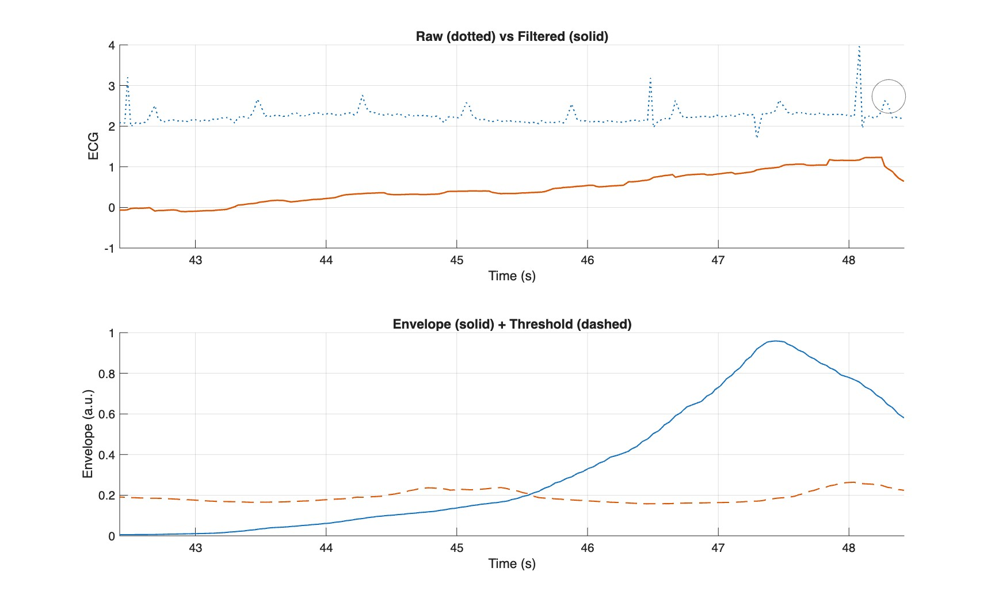

# ECG Signal Analysis (MATLAB)

## Overview
This project performs ECG signal analysis using MATLAB, including
preprocessing, peak detection, and heart rate calculation.

## Files
- `ecg_emily_delgado.m` — main MATLAB analysis script
- `ecg_run1.csv` — raw ECG signal data
- `ecg_run1_analyzed.mat` — processed ECG data
- `ECG.jpg` — example ECG signal visualization

## Methods
1. Signal preprocessing and baseline correction
2. Noise filtering
3. R-peak detection
4. Heart rate calculation

## Results

## Tools
- MATLAB

